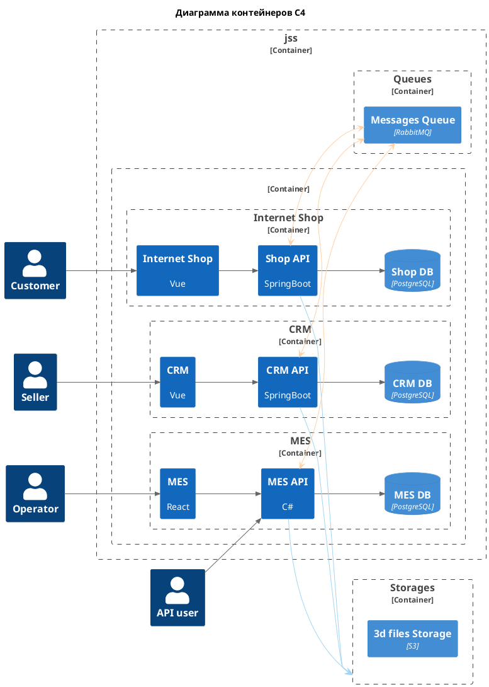

# AS IS

1. Самая серьезная проблема -- это задержка заказов на несколько месяцев.   
   - Скорее всего, заказы теряются в ShopDB, поскольку потери началось еще до внедрения API;   
   - со стороны MES API заказы могут теряться в очереди Messages Queue. Это нужно выяснить.
1. ShopDB используется двумя сервисами (Shop и CRM).
1. Нагрузка на чтение (скорее на агрегирование) MES DB. 

# Need

1. Разделить Shop DB на две: "Shop DB" и "CRM API DB"
1. Настроить мониторинг и трейсинг. Чтобы выяснить:
   - где и почему теряются заказы? Внимательно следить за ShopDB и за Message Queue. 
   - какие сервисы и Базы Данных перегружены и их необходимо масштабировать?
1. Убедиться в надежности доставки сообщений в Messages Queue. 
1. Настроить кеширование для MES

# Main

Приоритет задач будет такой:

1. Разделить Shop DB.  
Первая, потому что ее нужно делать независимо от результатов исследования и мониторинга.  
Возможно разделение Shop DB на две БД решит проблему нагрузки и потери заказов.  
1. Настроить мониторинг.  
Эта задача может выполняться одновременно с первой.  Нужна чтобы определить какие сервисы и БД будем масштабировать в первую очередь.
1. Кешировать MES

Если выбирать только три задачи на первые полгода, то выбрал бы:
1. Разделить Shop DB. 
1. Настроить мониторинг. 
1. А третью бы определил после настройки мониторинга и некоторого анализа.  
Сокрее всего это будет "Кешировать MES", но, возможно, выявится какая-то более важная задача.

**Примерна архитектура через полгода**

Можно заметить, что теперь каждый сервис пользуется только своей БД.  
А поскольку у Shop и CRM теперь разные БД, общаться они будут через шину данных, Rabbit или Kafka.

