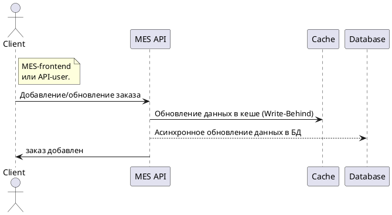
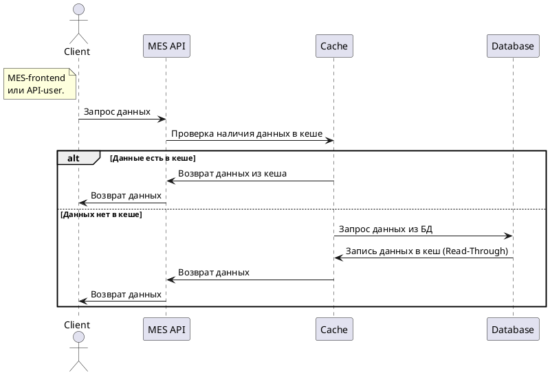

# Мотивация
В нашей системе есть одно явное место, которое нуждается в кешировании.  
Это MES-frontend приложение.  

# Предлагаемое решение
Предлагаю применить серверное кеширование, поскольку данные динамические, 
а клиенту (оператору) важно получать актуальные данные.  

Выбрать паттерн: 
- ~~`Cache-Aside`~~ - возможна несогласованность данных, для нас это критично.
- `Read-Through` - Этот паттерн, похоже, нам подходит, 
но он ни как не оптимизирует запись и обновление в БД. Только чтение.
- ~~`Refresh-ahead`~~ - неполная согласованность. Нам не подходит.
- ~~`Write-Through`~~ - придется ждать запись в БД, могут быть задержки для клиента
- `Write-Behind` - лучше других подходит, поскольку кеш всегда валидный, 
и запись в БД ассинхронная, а значит для пользователя это будет быстрее.

Выбираем сочетание паттернов `Write-Behind` и `Read-Through` поскольку для нас важны и Чтение и Запись.  
Кроме того эти паттерны подразумевают программную инвалидацию, которая гарантирует согласованность данных. 
Для нас это критично. 

## Запись

## Чтение

